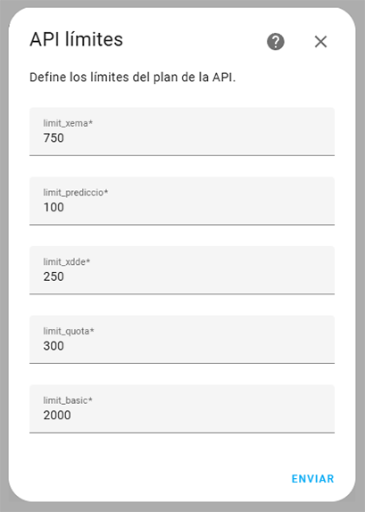
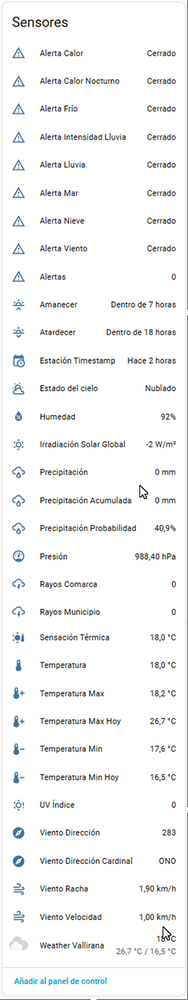
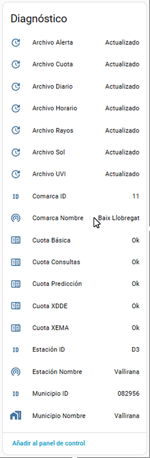
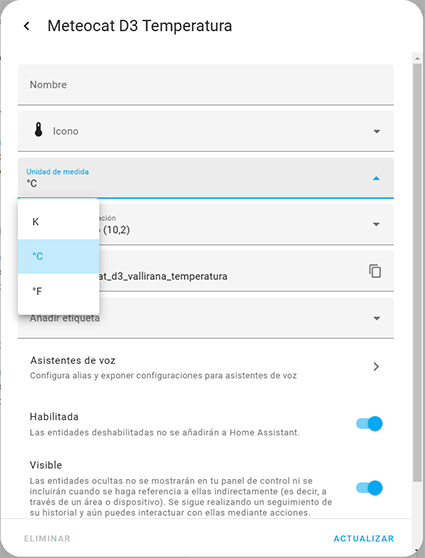
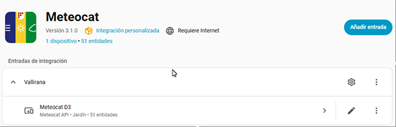
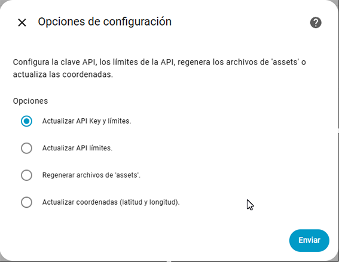

# Meteocat for Home Assistant

[]

[![Breaking Changes](https://img.shields.io/badge/Breaking%20Changes-critical?logo=data:image/svg+xml;base64,PHN2ZyBpZD0iTGF5ZXJfMSIgZGF0YS1uYW1lPSJMYXllciAxIiB4bWxucz0iaHR0cDovL3d3dy53My5vcmcvMjAwMC9zdmciIHZpZXdCb3g9IjAgMCAxMjIuODggMTExLjU0Ij48ZGVmcz48c3R5bGU+LmNscy0xe2ZpbGw6IzFhMWExYTt9LmNscy0ye2ZpbGw6I2ZmZWYxMTtmaWxsLXJ1bGU6ZXZlbm9kZDt9PC9zdHlsZT48L2RlZnM+PHRpdGxlPmNhdXRpb248L3RpdGxlPjxwYXRoIGNsYXNzPSJjbHMtMSIgZD0iTTIuMzUsODQuNDIsNDUuMjgsMTAuMmwuMTctLjI3aDBBMjMsMjMsMCwwLDEsNTIuNSwyLjY5LDE3LDE3LDAsMCwxLDYxLjU3LDBhMTYuNywxNi43LDAsMCwxLDkuMTEsMi42OSwyMi43OSwyMi43OSwwLDAsMSw3LDcuMjZxLjE5LjMyLjM2LjYzbDQyLjIzLDczLjM0LjI0LjQ0aDBhMjIuNDgsMjIuNDgsMCwwLDEsMi4zNywxMC4xOSwxNy42MywxNy42MywwLDAsMS0yLjE3LDguMzUsMTUuOTQsMTUuOTQsMCwwLDEtNi45Myw2LjZjLS4xOS4xLS4zOS4xOC0uNTguMjZhMjEuMTksMjEuMTksMCwwLDEtOS4xMSwxLjc1djBIMTcuNjFjLS4yMiwwLS40NCwwLS42NSwwYTE4LjA3LDE4LjA3LDAsMCwxLTYuMi0xLjE1QTE2LjQyLDE2LjQyLDAsMCwxLDMsMTA0LjI0YTE3LjUzLDE3LjUzLDAsMCwxLTMtOS41NywyMywyMywwLDAsMSwxLjU3LTguNzQsNy42Niw3LjY2LDAsMCwxLC43Ny0xLjUxWiIvPjxwYXRoIGNsYXNzPSJjbHMtMiIgZD0iTTksODguNzUsNTIuMTIsMTQuMTZjNS4yNC04LjI1LDEzLjU0LTguNDYsMTguODcsMGw0Mi40Myw3My42OWMzLjM5LDYuODEsMS43MSwxNi05LjMzLDE1Ljc3SDE3LjYxQzEwLjM1LDEwMy44LDUuNjcsOTcuNDMsOSw4OC43NVoiLz48cGF0aCBjbGFzcz0iY2xzLTEiIGQ9Ik01Ny41Nyw4Mi42OUE1LjQ4LDUuNDgsMCwwLDEsNjEsODEuMTFhNS42Niw1LjY2LDAsMCwxLDQuNDIsMS42Niw1LjUzLDUuNTMsMCwwLDEsMS42MiwzLjU0QTUuNiw1LjYsMCwwLDEsNjcsODcuNzJhNiw2LDAsMCwxLS40MiwxLjM0LDUuNTMsNS41MywwLDAsMS0yLjkyLDIuODQsNS43OSw1Ljc5LDAsMCwxLTQuNTctLjEsNS41MSw1LjUxLDAsMCwxLTIuODEtMi45NCw1LjMxLDUuMzEsMCwwLDEtLjM2LTEuMjcsNS45LDUuOSwwLDAsMS0uMDYtMS4zMmgwYTYuNDUsNi40NSwwLDAsMSwuNTctMiw0LjYsNC42LDAsMCwxLDEuMTQtMS41NlptOC4xNS0xMC4yNGMtLjE5LDQuNzktOC4zMSw0LjgtOC40OSwwLS44Mi04LjIxLTIuOTItMjcuNy0yLjg2LTM1LjQyLjA3LTIuMzgsMi0zLjc4LDQuNTYtNC4zMmExMS4xOSwxMS4xOSwwLDAsMSwyLjQ5LS4yNCwxMS43NywxMS43NywwLDAsMSwyLjUuMjVjMi42MS41NSw0LjY1LDIsNC42NSw0LjQ0di4yNEw2NS43Miw3Mi40NVoiLz48L3N2Zz4=&logoColor=white)](#-breaking-changes---upgrade-to-3x)

This is a project to obtain meteorological data from the Meteocat API inside the Home Assistant environment.

All the data is property of Meteocat ("Servei Meteorològic de Catalunya"). This project is only a tool to offer an easy and secure access to the meteorological data provided by the "Servei Meteorològic de Catalunya" API, so you can use the data for your personal use.

Commercial use of this project or the data obtained from the API is not allowed without prior permission from the author, in case of the project, or from the "Servei Meteorològic de Catalunya" in the case of the data provided by the API.

**NOTE:** Meteocat API requires to use an API_KEY, you should ask to (https://apidocs.meteocat.gencat.cat/documentacio/acces-ciutada-i-administracio/)

# Credits

This is a personal project.

**Authors:**  
- [Figorr](https://github.com/figorr)

**Contributors:**  
- [mcasellas](https://github.com/mcasellas) – contributed [c505f27](https://github.com/figorr/meteocat/commit/c505f27) - Improve Catalan translations

## ⚠️ Breaking changes - Upgrade to 3.0.0 or later coming from prior versions

Version **3.0.0 and later** introduces a **breaking change** in how entities are identified.

### ⚠️ What this affects
- This affects any update **from a version prior to 3.0.0** to **any version 3.x or later**. 
- Entities now use **`town_id`** instead of `region_id` in their `unique_id`.  
- This change allows multiple integration entries that share the same `region_id` but different towns.  

### ✅ Recommended upgrade procedure
To avoid issues with duplicated or unavailable entities:

1. **Uninstall** the existing integration (v2.x). 
  🔗 See [Uninstallation Guide](https://github.com/figorr/meteocat/wiki/Uninstallation) for the proper way of removing prior versions.  
2. **Restart** Home Assistant.  
3. **Install v3.0.0 or later** and configure the integration again.  

### 🚨 If you update directly
If you update without uninstalling first:

- Old entities will remain as **Unavailable**.  
- New entities will be created (sometimes with a suffix like `2`).  
- You may need to manually **remove old entities** and update your automations, dashboards, or scripts to point to the new entities.

### 📑 Additional notes

- This change affects all entity types, including **sensors, diagnostic sensors, and alerts**.  
- Always backup your **Home Assistant configuration** before performing major upgrades.

## Installation

#### HACS - Install using the custom repository method.

1. First of all you need to add a custom repository like [this](https://hacs.xyz/docs/faq/custom_repositories/).
1. Then download the integration from HACS.
1. Restart Home Assistant.
1. Go to `Settings > Devices & Services`
1. Click `+ Add Integration`
1. Search for `Meteocat` and follow the configuration instructions

#### HACS - Install from the store
1. Go to `HACS`
1. Search for `Meteocat` and add it to HACS
1. Restart Home Assistant
1. Go to `Settings > Devices & Services`
1. Click `+ Add Integration`
1. Search for `Meteocat` and follow the configuration instructions

#### Manually
Copy the `custom_components/meteocat` folder into the config folder.

## Configuration
To add a Meteocat Device, go to `Configuration > Integrations` in the UI. Then click the `+` button and from the list of integrations select Meteocat. You will then be prompted to enter your API Key.

After submitting your API Key you will either be prompted to pick a town from the list as shown below.

Once you pick the town you will be prompted to pick a station from the list. These are the nearest stations to the picked town.

Then you will be asked to set the API limits from your plan.

Then you will be asked to pick an area for the device.

If the device is added successfully it should appear as shown.

This device will then have the entities shown below. The sensors are translated to your system language (according to tranlation folder: en, es, ca). Or English by default.

## Changing Units

To change units select one of the entities and open the more info dialog and click the cog in the top right. This will bring up the settings for the entity. Then select `Unit of Measurement`, and a dropdown will appear where you can select the units you want.

## Options

Once the integration is installed, you can reconfigure some parameters without having to remove and reinstall Meteocat.

Go to:
`Settings > Devices & Services > Meteocat > Configure`

You will see three available options:

- **Update API Key and limits**  
  Allows you to change the API Key and update all API plan limits at the same time.

- **Update limits only**  
  Allows you to adjust only the API plan limits, keeping the same API Key.

- **Regenerate assets**  
  If for any reason some files in the `assets` folder (`towns.json`, `stations.json`, `variables.json`, `symbols.json`, or `stations_<town_id>.json`) are missing or outdated, you can regenerate them directly from the options menu.  
  > ℹ️ If the Meteocat API is not available at that moment, the integration will still start, and you can retry regeneration later.

- **Update coordinates and elevation**  
  Change the default station coordinates and elevation that were set during the first setup. So you can use your location coordinates and elevation for more accurate sun and moon data.

### Accessing the Options Menu

You can access the Options Menu in two ways, both inside the integration:

- **Setup Options**  

  

- **System Options**  

  

  Once you are inside, you will see the following options:  

  

## Uninstallation

To correctly uninstall the integration:

- If you are upgrading due to **breaking changes**, remove all configured entries from  
  **Settings > Devices & Services > Integrations**, restart Home Assistant, and reinstall the new version.  
- If you want to **completely remove Meteocat**, after removing the entries and restarting, also uninstall the integration from **HACS > Integrations**.

👉 For detailed steps with screenshots, check the [Uninstallation Guide](https://github.com/figorr/meteocat/wiki/Uninstallation).

## Custom Meteocat Card available

Meteocat integration has its own weather card.

To install the card, please follow the instructions from its own repository, [🎫 Meteocat Card](https://github.com/figorr/meteocat-card).

# Documentation

For more detailed information about:
- Installation and configuration  
- Usage examples  
- Extra attributes in sensors  
- Known issues and troubleshooting  

please visit the [📖 Meteocat Wiki](https://github.com/figorr/meteocat/wiki).

# Contributing

1.  [Check for open features/bugs](https://github.com/figorr/meteocat/issues)
    or [initiate a discussion on one](https://github.com/figorr/meteocat/issues/new/choose).
2.  [Fork the repository](https://github.com/figorr/meteocat/fork).
3.  Install the dev environment: `make init`.
4.  Enter the virtual environment: `pipenv shell`
5.  Code your new feature or bug fix.
6.  Write a test that covers your new functionality.
7.  Update `README.md` with any new documentation.
8.  Run tests and ensure 100% code coverage for your contribution: `make coverage`
9.  Ensure you have no linting errors: `make lint`
10. Ensure you have typed your code correctly: `make typing`
11. Add yourself to `AUTHORS.md`.
12. Submit a pull request!

# License

[Apache-2.0](LICENSE). By providing a contribution, you agree the contribution is licensed under Apache-2.0.

# API Reference

[See the docs 📚](https://apidocs.meteocat.gencat.cat/section/informacio-general/).